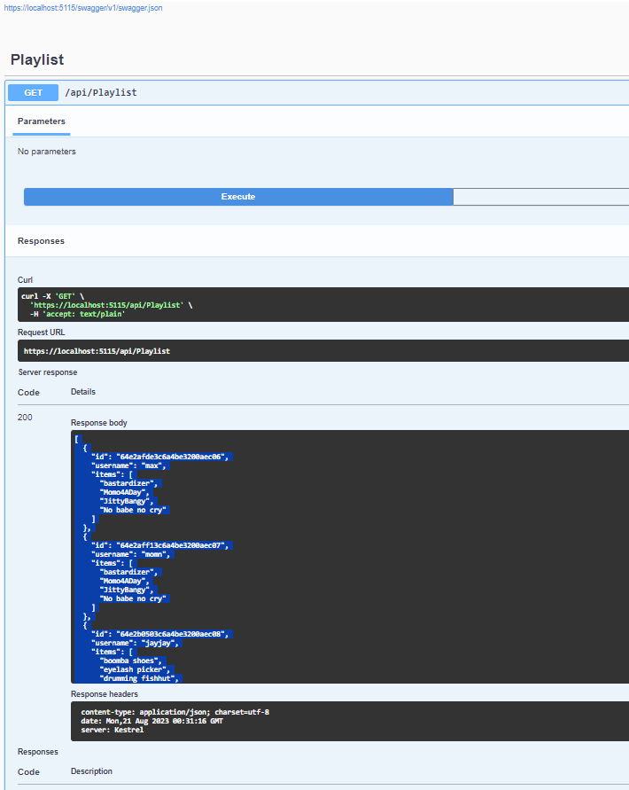

# RESTful API with ASP.NET Core and MongoDB

## Bootstrap with `dotnet` CLI

**Pre-requisites:**

*ASP.NET Core 7.0.10*, 
*MongoDB.driver*, 
*SwaggerUI*

```powershell
dotnet new webapi -o schoolappmongo.api

cd schoolaoomongo.api

dotnet add package MongoDB.driver

code .
```

## Define Environment Variables for Database Connectivity


```powershell
edit appsettings.json
```

Host: localhost:27017

Cluster: Standalone Edition

MongoDB 5.0.9 Community


```JSON
  "MongoDB": {
      "ConnectionURI": "mongodb://localhost:27017/",
      "DatabaseName": "SchoolApps",
      "CollectionName": "playlist"
  }
```


## Create `Controller` 

```
touch Controllers\PlaylistController.cs
```

```c#
using System;
using Microsoft.AspNetCore.Mvc;
using SchoolApp.mongo.API.Services;
using SchoolApp.mongo.API.Models;
using MongoDB.Driver;

namespace SchoolApp.mongo.API.Controllers; 

[Controller]
[Route("api/[controller]")]
public class PlaylistController: Controller {
    
    private readonly MongoDBService _mongoDBService;

    public PlaylistController(MongoDBService mongoDBService) {
        _mongoDBService = mongoDBService;
    }

    [HttpGet]
    public async Task<List<Playlist>> Get() {
        return await _mongoDBService.GetAsync();
    }

    [HttpPost]
    public async Task<IActionResult> Post([FromBody] Playlist playlist) {
        await _mongoDBService.CreateAsync(playlist);
        return CreatedAtAction(nameof(Get), new { id = playlist.Id }, playlist);
    }

    [HttpPut("{id}")]
    public async Task<IActionResult> AddToPlaylist(string id, [FromBody] string movieId) {
        await _mongoDBService.AddToPlaylistAsync(id, movieId);
        return NoContent();
    }

    [HttpDelete("{id}")]
    public async Task<IActionResult> Delete(string id) {
        await _mongoDBService.DeleteAsync(id);
        return NoContent();
    }

}
```

<br>

```powershell
touch Models\MongoDBSettings.cs
```

```C#
using SchoolApp.mongo.API.Models;
using Microsoft.Extensions.Options;
using MongoDB.Driver;
using MongoDB.Bson;

using Microsoft.AspNetCore.Mvc;

namespace SchoolApp.mongo.API.Services;

public class MongoDBService {

    private readonly IMongoCollection<Playlist> _playlistCollection;

    public MongoDBService(IOptions<MongoDBSettings> mongoDBSettings) {
        MongoClient client = new MongoClient(mongoDBSettings.Value.ConnectionURI);
        IMongoDatabase database = client.GetDatabase(mongoDBSettings.Value.DatabaseName);
        _playlistCollection = database.GetCollection<Playlist>(mongoDBSettings.Value.CollectionName);
    }

    public async Task<List<Playlist>> GetAsync() {
        return await _playlistCollection.Find(new BsonDocument()).ToListAsync();
     }

    public async Task CreateAsync(Playlist playlist) {
        await _playlistCollection.InsertOneAsync(playlist);
        return;
     }
    public async Task AddToPlaylistAsync(string id, string movieId) {
        FilterDefinition<Playlist> filter = Builders<Playlist>.Filter.Eq("Id", id);
        UpdateDefinition<Playlist> update = Builders<Playlist>.Update.AddToSet<string>("items", movieId);
        await _playlistCollection.UpdateOneAsync(filter, update);
        return;
    }
    public async Task DeleteAsync(string id) {
        FilterDefinition<Playlist> filter = Builders<Playlist>.Filter.Eq("Id", id);
        await _playlistCollection.DeleteOneAsync(filter);
        return;        
     }
}
```
<br>

**Define route** `playlist`

```powershell
touch Models\Playlist.cs
```

```C#
using MongoDB.Bson;
using MongoDB.Bson.Serialization.Attributes;
using System.Text.Json.Serialization;

namespace SchoolApp.mongo.API.Models;

public class Playlist {

    [BsonId]
    [BsonRepresentation(BsonType.ObjectId)]
    public string? Id { get; set; }

    public string username { get; set; } = null!;

    [BsonElement("items")]
    [JsonPropertyName("items")]
    public List<string> movieIds { get; set; } = null!;

}
```

## Create `Services`

```powershell
touch Services\MongoDBService.cs
```

```C#
using SchoolApp.mongo.API.Models;
using Microsoft.Extensions.Options;
using MongoDB.Driver;
using MongoDB.Bson;

using Microsoft.AspNetCore.Mvc;

namespace SchoolApp.mongo.API.Services;

public class MongoDBService {

    private readonly IMongoCollection<Playlist> _playlistCollection;

    public MongoDBService(IOptions<MongoDBSettings> mongoDBSettings) {
        MongoClient client = new MongoClient(mongoDBSettings.Value.ConnectionURI);
        IMongoDatabase database = client.GetDatabase(mongoDBSettings.Value.DatabaseName);
        _playlistCollection = database.GetCollection<Playlist>(mongoDBSettings.Value.CollectionName);
    }

    public async Task<List<Playlist>> GetAsync() {
        return await _playlistCollection.Find(new BsonDocument()).ToListAsync();
     }

    public async Task CreateAsync(Playlist playlist) {
        await _playlistCollection.InsertOneAsync(playlist);
        return;
     }
    public async Task AddToPlaylistAsync(string id, string movieId) {
        FilterDefinition<Playlist> filter = Builders<Playlist>.Filter.Eq("Id", id);
        UpdateDefinition<Playlist> update = Builders<Playlist>.Update.AddToSet<string>("items", movieId);
        await _playlistCollection.UpdateOneAsync(filter, update);
        return;
    }
    public async Task DeleteAsync(string id) {
        FilterDefinition<Playlist> filter = Builders<Playlist>.Filter.Eq("Id", id);
        await _playlistCollection.DeleteOneAsync(filter);
        return;        
     }
}
```

## Runtime

```shellscript
dotnet run
```

```powershell
PS D:\devel\C-SharpProjs\LINKEDIN_TRAINING_2023\.NET7API\SchoolApp.mongo.API> dotnet run
Building...
info: Microsoft.Hosting.Lifetime[14]
      Now listening on: https://localhost:5115
info: Microsoft.Hosting.Lifetime[0]
      Application started. Press Ctrl+C to shut down.
info: Microsoft.Hosting.Lifetime[0]
      Hosting environment: Development
info: Microsoft.Hosting.Lifetime[0]
      Content root path: D:\devel\C-SharpProjs\LINKEDIN_TRAINING_2023\.NET7API\SchoolApp.mongo.API
```

Open the browser to https://localhost:5115/swagger/

## Snapshots


<br >




## Conclusion

Although ASP.NET Core webapi template is preconfigured to bootstrap the MVC with SQL as the default database, with a little legwork, we can create the service necessary for integration with MongoDB, or MySQL following the steps above.  The hightlights of this article are  

*[Database],driver* is versatile and can be defined in the appsettings as variables.  Data can then be accessed via `Service`

*Controller* specified for CRUD can be pointed to specific collection(s) defined in the models.